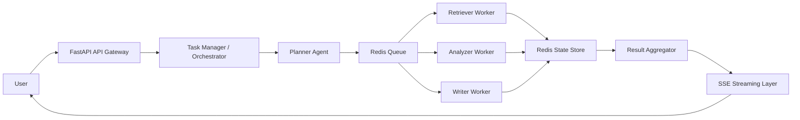

# Agentic AI System for Multi-Step Task Execution

This project is a production-oriented reference implementation of an agentic backend that accepts natural-language tasks, decomposes them into structured steps, dispatches work asynchronously through Redis, and streams progress back to clients in real time.

## Assignment Coverage Checklist

- Accept a complex user task: implemented via `POST /api/v1/tasks`.
- Break it into multiple steps: implemented by the planner agent with explicit structured step definitions.
- Assign steps to specialized agents: retriever, analyzer, and writer are separate modules with clear ownership.
- Use async pipelines or message queues: Redis-backed async queue plus an async worker loop.
- Stream partial responses to the user: SSE endpoint at `GET /api/v1/stream/{task_id}` and a small live dashboard at `/`.
- Agent-based architecture: implemented without black-box agent frameworks.
- Async inference pipeline: end-to-end async FastAPI, Redis, worker, and retry flow.
- Retry and failure handling: exponential backoff retries, persisted step states, and terminal failure events.
- Manual batching logic: implemented in `app/services/llm.py`.
  

## Architecture



`architecture.png` is included as a placeholder binary asset for repository completeness. The Mermaid diagram above is the source of truth for the system design.

## Project Structure

```text
agentic-system/
├── app/
│   ├── api/
│   ├── agents/
│   ├── core/
│   ├── db/
│   ├── models/
│   ├── orchestrator/
│   ├── services/
│   ├── workers/
│   └── main.py
├── tests/
├── requirements.txt
├── docker-compose.yml
├── README.md
└── architecture.png
```

## Core Design

- FastAPI provides the API gateway, health endpoint, task submission, and SSE streaming.
- Redis acts as the queue transport, event bus, and state backend.
- The planner performs explicit task decomposition without depending on black-box agent frameworks.
- The scheduler releases only dependency-ready steps, which keeps execution deterministic and fault-aware.
- Worker agents are modular and independently swappable.
- A local-first generation layer produces useful end-user responses even without an external model connection.
- Retry logic uses exponential backoff and assumes idempotent step execution contracts.
- The writer output is promoted to the final task result when all steps succeed.

## Execution Flow

1. `POST /api/v1/tasks` stores the task and runs the planner.
2. The scheduler identifies dependency-free steps and pushes them to `agent_tasks`.
3. Workers consume queue messages and execute the assigned agent asynchronously.
4. Each step result is written to Redis and emitted to the task-specific streaming channel.
5. Once all steps complete, the writer result becomes the final answer and a terminal SSE event is published.

## Streaming Contract

Example progress event:

```json
{
  "task_id": "uuid",
  "status": "in_progress",
  "step_id": 2,
  "step": "Analyze the retrieved context and extract actionable insights",
  "partial_result": "analyzer is processing step 2"
}
```

Example terminal event:

```json
{
  "task_id": "uuid",
  "status": "completed",
  "partial_result": "Final answer"
}
```

## Running Locally

### Option 1: Docker Compose

```bash
docker compose up --build
```

### Option 2: Local Python

```bash
python -m venv .venv
. .venv/bin/activate
pip install -r requirements.txt
uvicorn app.main:app --reload
python -m app.workers.worker
```

## API Usage

Open the live dashboard:

```bash
open http://localhost:8000/
```

If port `8000` is occupied on your machine, use the port you started Uvicorn on instead. The dashboard includes:

- a polished task submission surface
- example prompts
- recent-task replay
- a friendly final-result panel
- an optional technical-details toggle for evaluators

Submit a task:

```bash
curl -X POST http://localhost:8000/api/v1/tasks \
  -H "Content-Type: application/json" \
  -d '{"task":"Research recent customer pain points and produce an executive summary"}'
```

Stream progress:

```bash
curl -N http://localhost:8000/api/v1/stream/<task_id>
```

Fetch task snapshot:

```bash
curl http://localhost:8000/api/v1/tasks/<task_id>
```

List recent tasks:

```bash
curl http://localhost:8000/api/v1/tasks
```

## Testing

```bash
pytest
```

The test suite includes:

- Planner unit tests
- Specialized agent unit tests
- Scheduler queueing behavior
- End-to-end pipeline progression with a fake Redis backend
- API-level task submission and retrieval tests

## Scalability Notes

- Redis list queues are simple and fast, but a very high task arrival rate can create a hot queue and uneven consumer pressure.
- The current planner is deterministic for reliability. A future distributed planner tier could scale decomposition separately from execution.
- Manual batching is implemented at the LLM service boundary so concurrent analyzer and writer work can be grouped without leaking batching complexity into business logic.
- Task state is centralized in Redis for low latency. For long-lived workloads, a relational event store may be better for auditability.

## Failure Handling

- Steps are retried up to 3 times with exponential backoff.
- Step outcomes are persisted after every state transition.
- Failed steps mark the parent task as failed and emit a terminal stream event.
- Idempotency is expected at the agent layer so repeated delivery does not corrupt task state.

## Monitoring

- Structured logging captures task lifecycle, retries, and failures.
- Prometheus and Grafana are not included yet, but the architecture leaves room for instrumentation hooks around queue latency, agent duration, and step success rate.

## Mandatory Post-Mortem

### 1. Scaling Issue

If many tasks arrive at once, the single shared Redis list for `agent_tasks` can become a bottleneck and increase tail latency for downstream agents.

### 2. Design Decision to Change

The first design change I would make is splitting the planner into its own horizontally scalable service and introducing agent-specific queues so retriever, analyzer, and writer workloads stop contending on one hot queue.

### 3. Trade-offs

- Simplicity vs scalability: Redis lists are straightforward but less sophisticated than Kafka-style partitions and consumer groups.
- Latency vs accuracy: a deterministic planner starts fast and is predictable, but a richer LLM planner may generate better plans at higher cost and latency.
- Cost vs performance: batching reduces LLM cost, but waiting to fill batches can slightly increase per-step latency.

## Future Improvements

- Priority-based scheduling
- Parallel execution for independent branches
- Result caching
- Role-based agent permissions
- Prometheus metrics and dashboards
